# Modelio for INTO-CPS SysML modelling

The Modelio tool and its SysML/INTO-CPS
profile extension provide the diagramming starting point. This section describes the Modelio extension that provides INTO-CPS-specific modelling
functionality to the SysML modelling approach.

The INTO-CPS extension module is based on the Modelio SysML extension
module, and extends it in order to fulfill INTO-CPS modelling requirements
and needs. Figure 28 shows an example of a simple INTO-CPS Architecture
Structure Diagram under Modelio. This diagram shows a _System_, named
“System” (An abstract description of an INTO-CPS multi-model)
, composed of two EComponents of kind _Subsystem_, named “SubSystem” (Abstract descriptions of INTO-CPS constituent models). These Subsystems have an internal Variable called “variable” of type String and expose two FlowPorts named “portIn” and “portOut”. The
type of data going through these ports is respectively defined by types In and Out of kind StrtType.

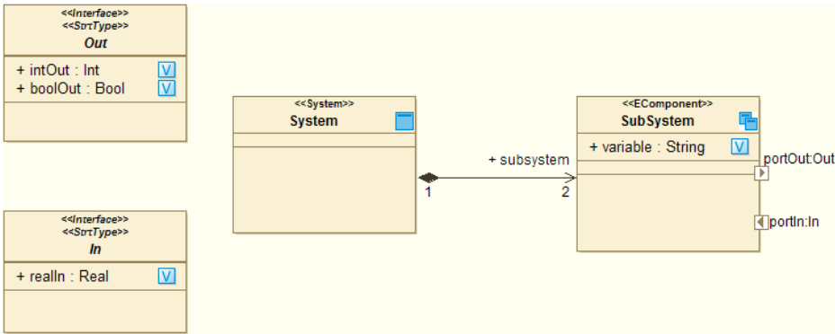

Figure 28: Example INTO-CPS multi-model.

Figure 29 illustrates the main graphical interface after Modelio and the
INTO-CPS extension have been installed. Of all the panes, the following
three are most useful in the INTO-CPS context.

1. The Modelio model browser, which lists all the elements of your model in tree form.
2. The diagram editor, which allows you to create INTO-CPS design architectures and connection diagrams.
3. The INTO-CPS property page, in which values for properties of INTOCPS subsystems are specified.

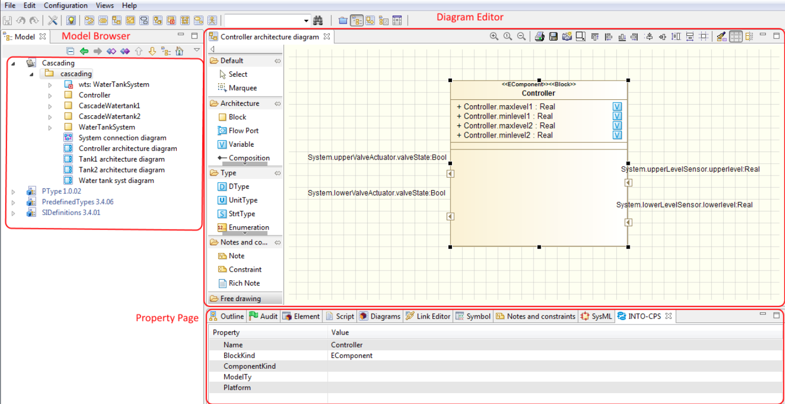

## Creating a New Project

first step will be to create, as depicted in Figure 30, a Modelio project:
1. Launch Modelio.
2. Click on File → Create a project....
3. Enter the name of the project.
4. Enter the description of the project.
6. Click on Create to create and open the project.

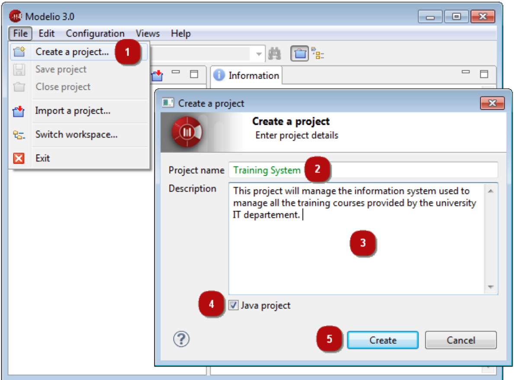

Once you have successfully created a Modelio project, you have to install the Modelio extensions required for INTO-CPS modelling, i.e. both Modelio SysML and INTO-CPS extensions, as described in the [installation guide](Installation.md)

If both modules have been correctly installed, you should be able to create,
under any package, an **INTO-CPS Architecture Structure Diagram** in order
to model the first subsystem of your multi-model. For that, in the Modelio
model browser, right click on a _Package_ element then in the _INTO-CPS_
entry, choose _Architecture Structure Diagram_ as shown in Figure 31. Once
you are sure that the modules have been correctly installed. You are able to
start your INTO-CPS SysML modelling.

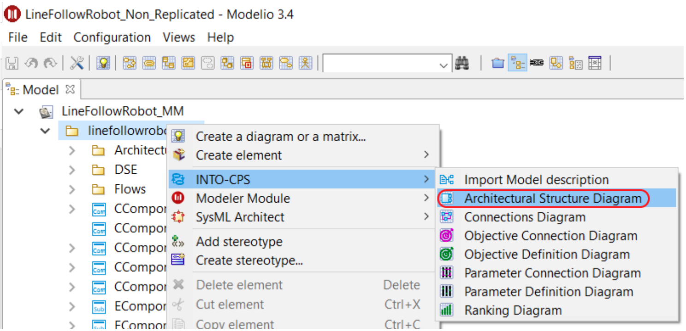
Figure 31: Creating an Architecture Structure diagram.

##  Architecture Structure Diagram

INTO-CPS SysML modelling activitIES can be succinctly described as the creation and population of INTO-CPS SysML diagrams.

The Architecture Structure Diagram (ASD) specialises SysML block definition diagrams (BDDs) to support the specification of a multi-model architecture described in terms of a systems components, which will be represented by FMUs.  Figure 31 shows you how to create an Architecture Structure Diagram. 

Figure 32 represents an example of an Architecture Structure Diagram. Besides creating an Architecture Structure Diagram from scratch and specifying by hand the blocks of your system, the INTO-CPS extension allows the user to create a block from an existing _modelDescription.xml_ file. A _modelDescription.xml_ file is an artifact defined in the FMI standard which specifies, in XML format, the public interface of an FMU. 

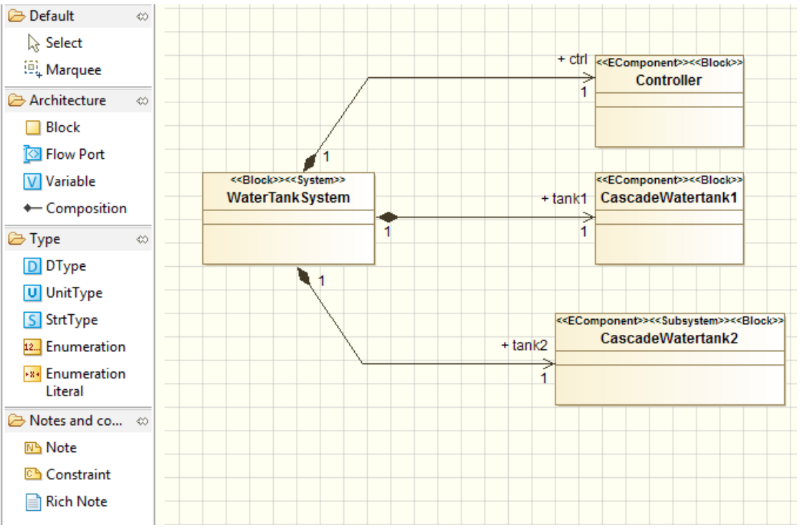

Figure 32: Example Architecture Structure diagram.

To import a _modelDescription.xml_ file:
1. Right click in the Modelio model browser on a Package element, then in the INTO-CPS entry choose Import Model description, as shown in Figure 33.
2. Select the desired modelDescription.xml file (or the .fmu file that should contain a modelDescription.xml file ) in your installation and click on Import (Figure 34).

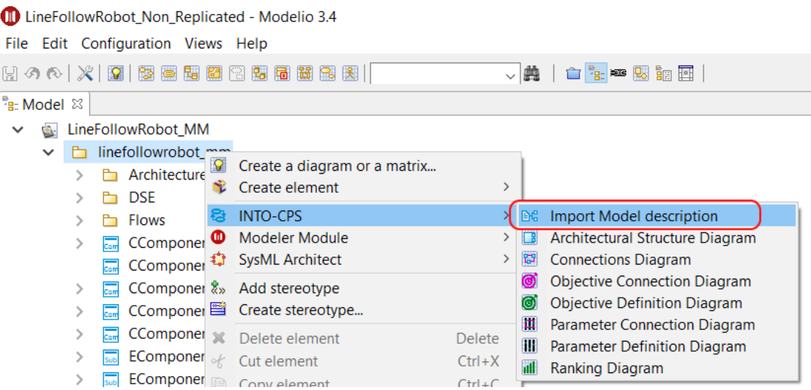
Figure 33: Importing an existing model description.

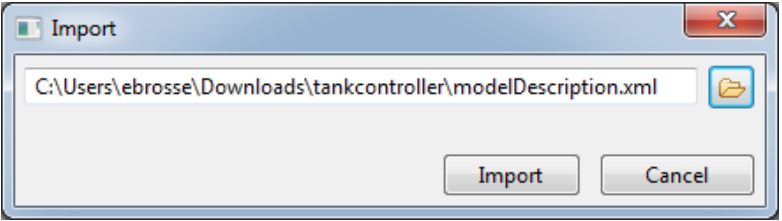
Figure 34: Model description selection.

This import command creates an Architecture Structure Diagram describing
the interface of an INTO-CPS block corresponding to the _modelDescription.xml_ file imported, cf. Figure 35. 

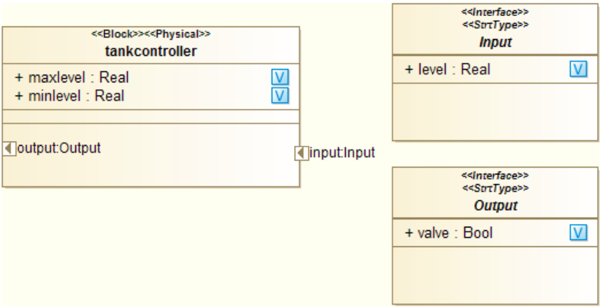
Figure 35: Result of model description import.

## Connection diagram
The SysML Connection diagram defines the components of the system and their connections. The internals of these block instances are created in the various modeling tools and exported as FMUs. The modeling tools Overture, 20-sim and OpenModelica support importing the interface definition (ports) of the blocks in the Connection diagram by importing a (FMI) _modelDescription.xml_ file containing the block name and its interface definition.

Once you have created several SysML blocks , either from scratch or by importing _modelDescription.xml_ files, you must eventually connect instances of them in an INTO-CPS Connection Diagram. To create an INTO-CPS Connection diagram, as for an INTO-CPS Architecture Structure Diagram, right click on a _Package_ element, then in the INTO-CPS entry choose _Connection Diagram_, as shown in Figure 36.

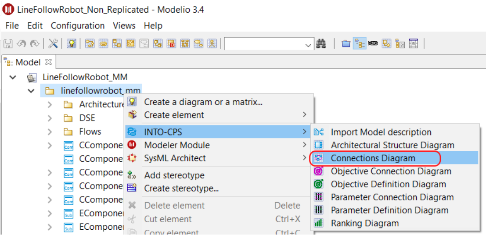
Figure 36: Creating a Connection diagram.

Figure 37 shows the result of creating such a diagram.

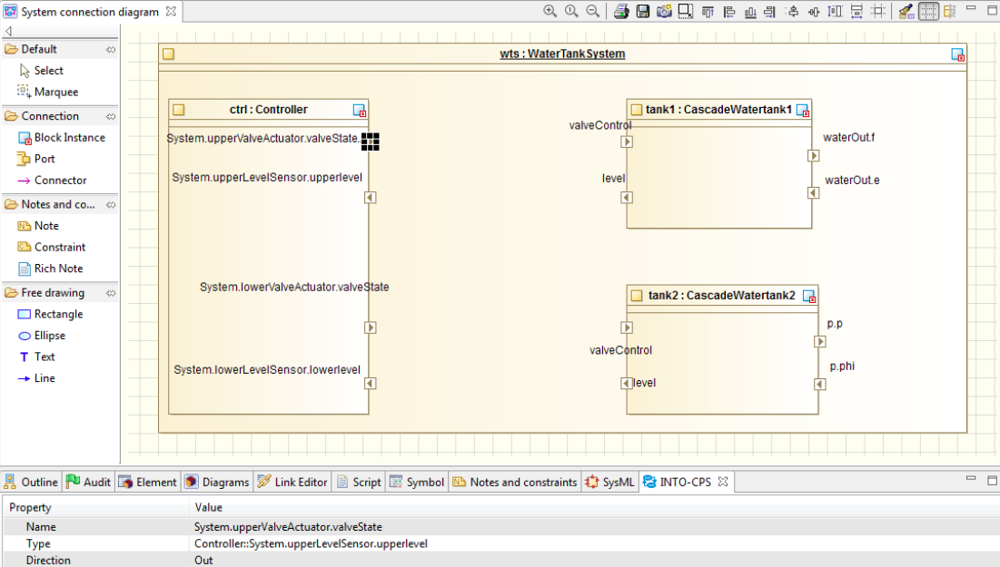
Figure 37: Unpopulated Connection diagram.

Once you have created all desired block instances and their ports by using the dedicated command in
the Connection Diagram palette, you will be able to model their connections
by using the connector creation command (Figure 38).

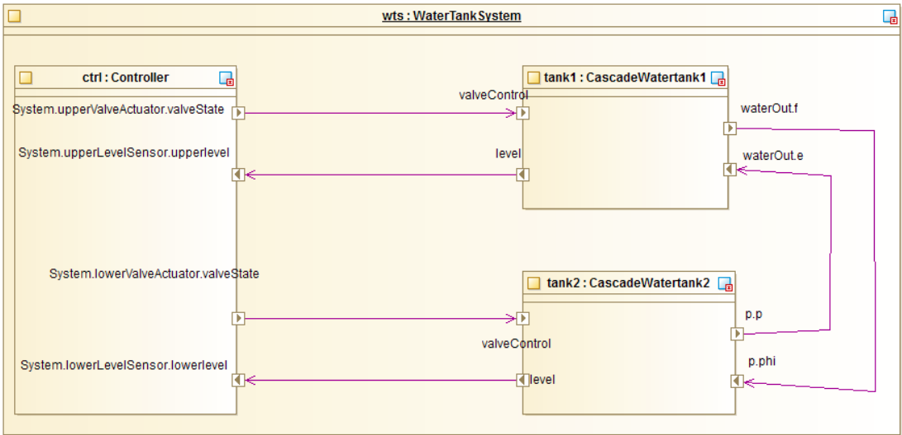
Figure 38: Populated Connection diagram.

At this point your blocks have been defined and the connections have been set. The next step is
to simulate your multi-model using the INTO-CPS Application. For that you
must first generate a configuration file from your Connection diagram. Select
the top element in the desired Connection diagram, right click on it and in
the INTO-CPS entry choose Generate configuration, as shown in Figure 39.

In the final step, choose a relevant block instance defining the interconnections of simulators and click on Generate. This will create a configuraiton json file for Maestro engine.

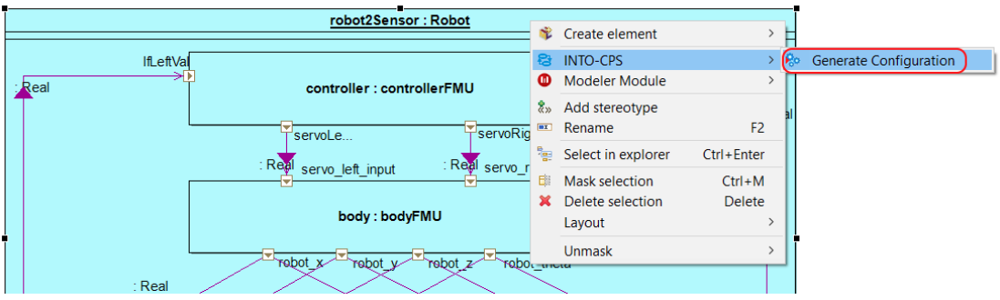
Figure 39: Generating a configuration file.

## Exporting FMI modelDescription.xml

Once you finished modelling the system components with Architecture Structure Diagram (ASD) you may export the SysML block as _modelDescription.xml_ for FMU packaging.

Follow these steps to export a modelDescription.xml file from Modelio:
1. In Modelio, right-click on the model block in the tree.
2. Select INTO-CPS → Generate Model Description (see Figure 40).
3. Choose a file name containing the text _modelDescription.xml_ and click Export.

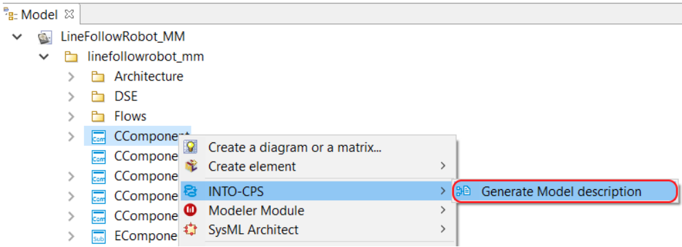
Figure 40: Exporting a modelDescription.xml file.

# TODO: DSE Modelling

